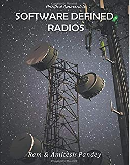

# Technical Portfolio
---

### Practical Approach to Software Defined Radio 

As the title suggests,you get to understand the the concepts of Software Defined Radio and hardware/software that help in wireless system design. After extensive survey it was found that adopting open source software/hardware could be right fit and hence the use of GNU Radio like open software and Ettus USRP open hardware has been used for all experiments. 

